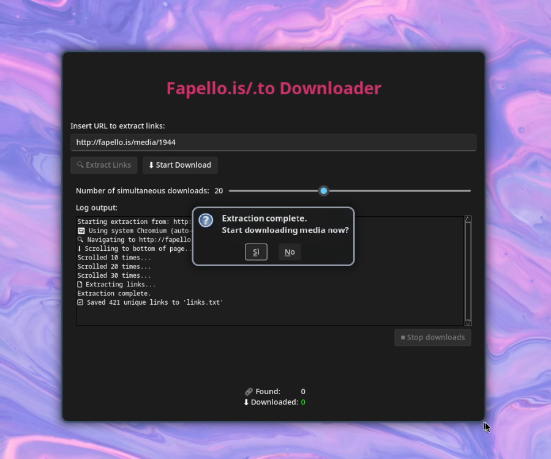
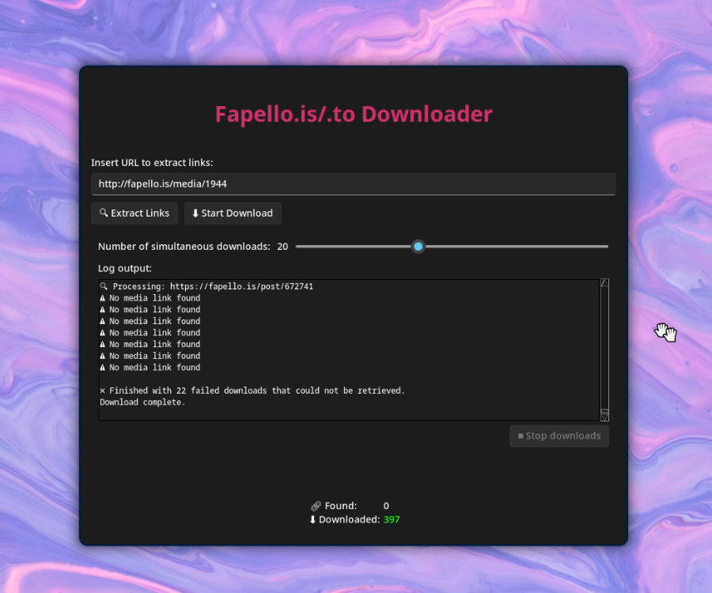

# **Fapello.is/.to Downloader**  
*A Tool for Downloading Content from Fapello.is and Fapello.to* on windows

  
  

Effortlessly download entire model galleries from Fapello.is/.to with this tool written in Python.

---

### 🔗 Buy & Download

You can get the portable version on Gumroad:

)

---

### **Features**  

#### **1. Full-Page Crawling**  
- Uses **headless Chromium** to dynamically load all content (including lazy-loaded media).  
- Automatically scrolls to the bottom of pages to capture **every post** in the feed.  

#### **2. High-Resolution Priority**  
- Prioritizes **HQ versions** of media (photos/videos).  
- Falls back to standard quality if needed—ensuring no downloads are missed.  

#### **3. Organized Downloads**  
- Saves files to `/downloads/[ID]/` with original filenames.  
- Prevents duplicates by checking against `/logs/[ID].txt` history.  

#### **4. Background Processing**  
- Supports **1–50 simultaneous downloads** (adjustable).  
- Automatically retries failed downloads (3 attempts by default).  

#### **5. Intuitive GUI**  
- Dark-mode interface with **real-time logs** and progress counters.  

#### **6. Portable & Lightweight**  
- No installation required—just run the `.exe` included in the portable version.
- Includes all dependencies for offline use.  

#### **7. Privacy-Focused**  
- **No data collection**—everything stays on your local machine.  

---

### **Usage**  
1. **Paste a Fapello URL** (e.g., `https://fapello.is/model/12345`).  
2. The tool will **scan and extract all media links**.  
3. Click **"Start Download"** to begin.  

---

### **Notes**  
- Failed downloads are typically due to **broken links**, not software issues.  
- If you wish to re-download files, delete the corresponding log in `/logs`.
- This is a side-project, but I’ll do my best to implement requested features when possible.

---

### **Known Issues**  
- The app may crash during large batch downloads with high concurrency.  
If that happens, try to reduce the amount of simultaneous downloads.  
- Found a bug? Open an issue here.

---

### **Terms**  
- For personal archival use only.
- Respect creators' rights and website terms of service.  

